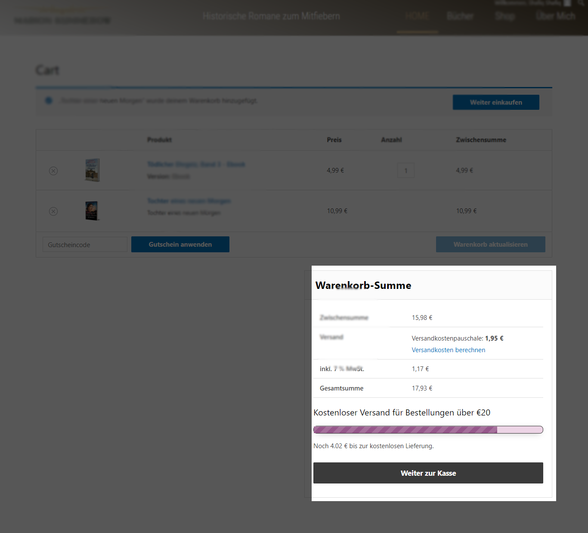
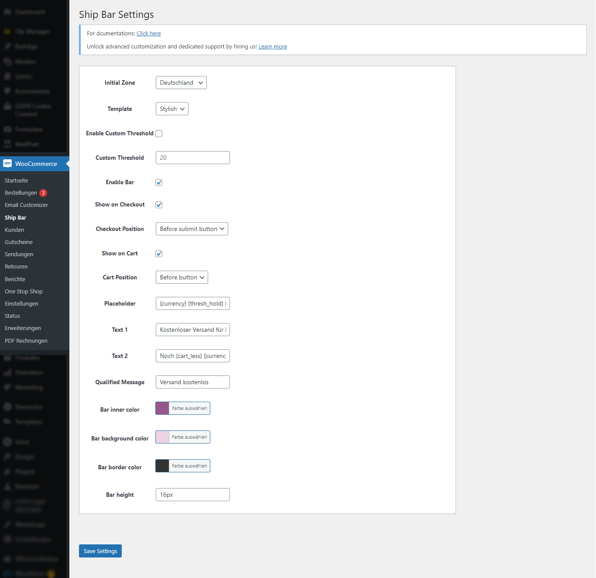

# Plugin Setup

## Installation

Simply install the plugin and activate it.

## Configuration

### Shipping zones

- Create at least one shipping zone with an active free shipping method.
- Set a free shipping amount in the settings.
  - To set the shipping option, navigate to `WooCommerce → Settings → Shipping → Shipping` options.
  - Then, from the plugin admin menu, go to `WooCommerce → Ship Bar` and select the shipping zone from the 'Initial zone'.

With these settings, the plugin will display the progress bar based on the 'Free shipping amount'.

If you want to override the free shipping amount, enable `Custom Threshold` in the settings and set the value.

### Enabling the Ship bar

- Navigate to `WooCommerce → Ship Bar`.
- Check the box `Enable ship bar` in the settings and click `Save`.

### Other settings

- Toggle the progress bar on/off on the cart page or checkout page using the relevant settings on the admin settings page. Also, select a position from the list.
- Choose a template for the progress bar.
- Set the progress bar message by configuring the 'Text' options.
- Finally, customize the color and height of the progress bar.

### Free shortcode

- Add the shortcode `[wa-ship-bar]` to the page or post where you want to display the progress bar.

### Screen shots

Progress bar

Settings

## Support

If you have any questions or suggestions, please feel free to [open an issue](https://github.com/shafiq-ahmad/ship-bar/issues) or [create a pull request](https://github.com/shafiq-ahmad/ship-bar)

## Thank you
